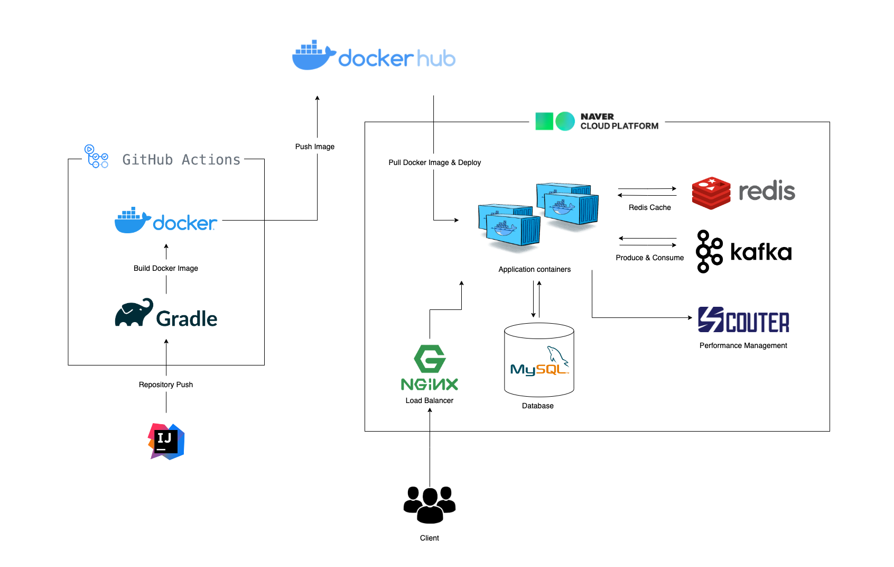
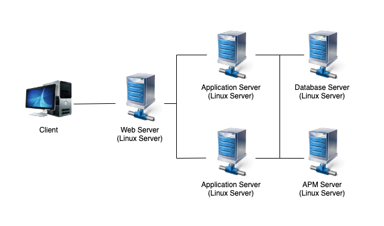
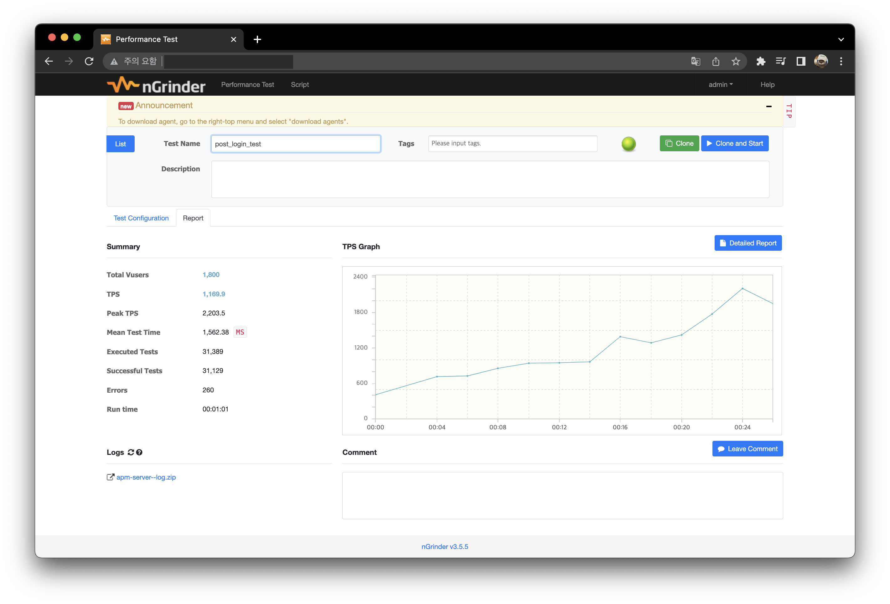
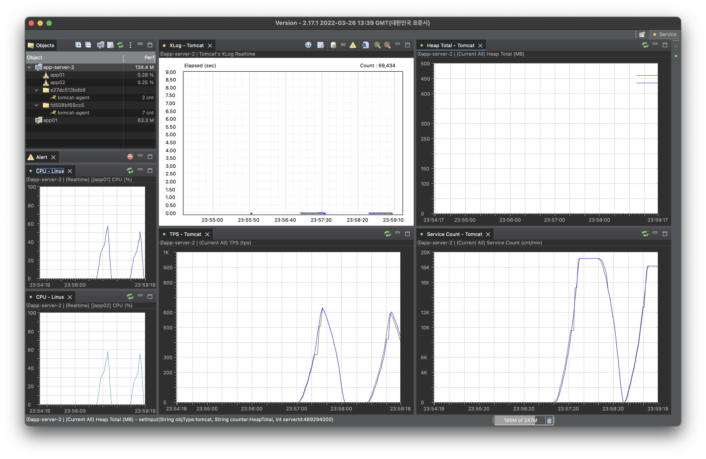

# unique-auction       :)

### 한정판 거래 플랫폼 Unique Auction

StockX와 국내 KREAM를 벤치마킹한 한정판 거래 플랫폼

Unique Auction은 Springboot, Mysql, JPA, Docker, Kafka, Redis, Scouter 기술스택을 사용하여 만들어진 프로젝트입니다.
패키지는 DDD 계층 구조를 따르고 있으며, 객체 지향 원칙을 준수하기 위해 노력했습니다.
Spring Boot와 JPA를 사용하여 백엔드를 개발하였으며, MySQL을 데이터베이스로 사용합니다. 또한 Docker를 활용해 컨테이너화하고 Kafka와 Redis를 사용하여 메시지 큐와 세션 기능을 구현했습니다.

## 01. Team convention
팀 협업을 위한 프로젝트 관리 규약  
[Team convention 바로가기](https://github.com/f-lab-edu/unique-auction/wiki/01.-Team-Convention)

## 02. Use case
유스케이스  
[Use case 바로가기](https://github.com/f-lab-edu/unique-auction/wiki/02.-Use-Case)

## 03. Structure
Unique Auction의 패키지 구조  
[Structure 바로가기](https://github.com/f-lab-edu/unique-auction/wiki/03.-Structure)

### 프로젝트 아키텍처

 

### 서버 구성도

 

## 04. Monitoring

성능 측면에서는 Scouter를 사용하여 애플리케이션 모니터링을 진행하고, Ngrinder를 사용하여 가상 유저 1800명으로 부하테스트를 수행했습니다. groovy로 작성된 스크립트를 사용해 부하테스트 코드를 작성했습니다. 이를 통해 자동화된 부하테스트를 더 쉽고 빠르게 수행할 수 있습니다. 
결과적으로 총 Test 요청 수 31000 TPS 1170, Peak TPS 2200, Error 260의 결과를 얻었습니다. 요청 처리율 99.2%에서 100%로 보장할 수 있도록 성능 병목현상을 찾아내고 최적화 작업을 진행할 계획입니다!

 

 

## 05. API Guide
API 가이드 문서    
[API Guide 바로가기](https://github.com/f-lab-edu/unique-auction/wiki/04.-API-Guide)

## 06. UI Prototype
UI 프로토타입 카카오 오븐    
[카카오 오븐 바로가기](https://ovenapp.io/project/rhOt2gGKUfVAahjHVQCyQMFDPGJ5ke8i#eW8W2)
